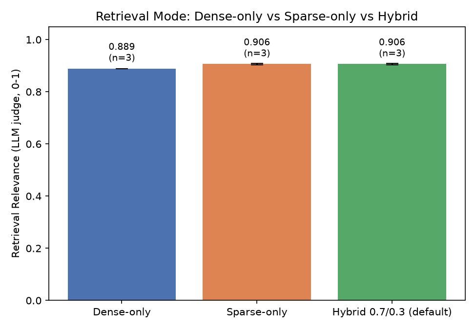
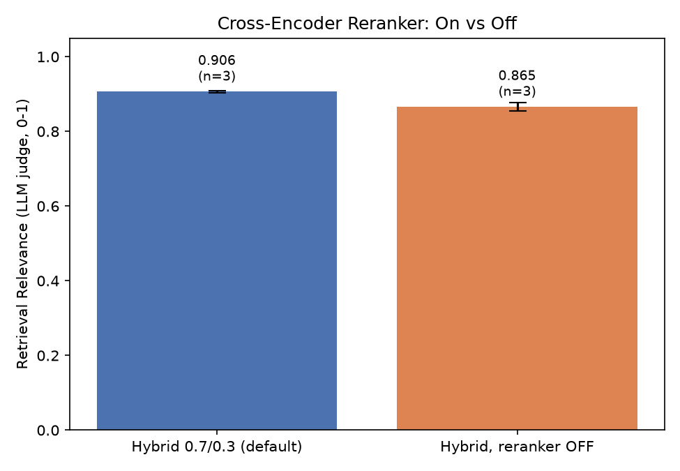
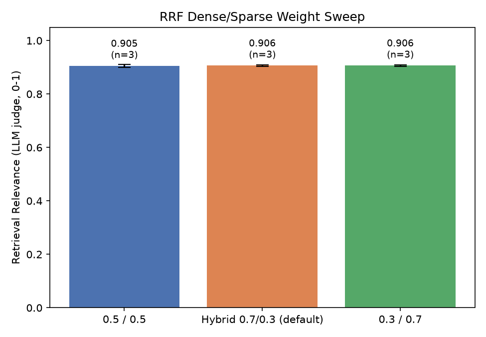

# Evaluation Results

**Corpus:** the IETF HTTP core standards. RFC 9110 (HTTP Semantics), RFC 9111 (HTTP Caching) and RFC 9112 (HTTP/1.1) total about 92,000 words of normative, heavily cross-referenced text. `scripts/fetch_corpus.py` downloads them and converts them to Markdown with their section structure intact.

**Evaluation set:** `evaluation_dataset.json` has 32 questions, written by hand against the RFC text rather than generated by an LLM:

| Type | Count | What it tests |
|---|---|---|
| Lookup | 14 | One fact from one section, e.g. which methods are safe, or the s-maxage rule |
| Multi-Hop | 9 | Facts from two sections, often in different RFCs, e.g. heuristic caching needs RFC 9110 §15.3.1 *and* RFC 9111 §4.2.2 |
| Unanswerable | 5 | Near-domain questions the corpus can't answer (HTTP/2 SETTINGS, WebSocket keys, 429, HSTS, QPACK). Each was checked to be absent from the corpus with grep |
| Ambiguous | 4 | Underspecified questions ("How long can it be cached?") |

Each Lookup and Multi-Hop question lists the RFC sections it depends on and one or more verbatim **evidence** passages. That allows retrieval to be scored exactly, by checking whether the chunks given to the generator contain the passage, with no LLM judge involved. Every evidence passage was verified to occur in the converted corpus.

The previous seven-file Apollo 11 corpus was too small to separate configurations: every metric sat between 0.98 and 1.00. Its results are archived in [`results/apollo11/RESULTS.md`](results/apollo11/RESULTS.md).

---

All numbers below come from runs on 2026-10-03 with `gpt-4o-mini` as both generator and judge, `text-embedding-3-small` embeddings and `cross-encoder/ms-marco-MiniLM-L-6-v2` as the reranker. The code was at commit `3c6aa98` or later; see "Code changes made before these runs" at the end.

## Headline findings

1. **The cross-encoder reranker makes retrieval worse on this corpus.** It reduced hit@5 in all 9 chunking × retrieval-mode combinations, and MRR in 7 of 9. With TokenRecursive chunks, hybrid retrieval loses 4 of 23 gold passages with the reranker on and 1 without it. There are two likely causes (see §1). The first is measured: a third to a half of the chunks are longer than the reranker's 512-token window, so it scores truncated text. The second is inferred: it still hurts on TokenRecursive chunks, where it sees 98% of the text, which points to a domain mismatch. The model was trained on short web-search passages, not normative spec prose.
2. **Multi-hop retrieval is the unsolved problem.** No configuration gets all the evidence for more than 4 of the 9 multi-hop questions into the top 5. TokenRecursive manages 1 of 9 in every configuration. A single query with k = 5 can't reliably collect two distant sections.
3. **Which retrieval mode is best depends on the chunking.** Dense retrieval is weak on Markdown chunks (whole RFC sections dilute the embedding: hit@5 0.739) but strong on Semantic chunks (0.913). Hybrid only beats BM25 when dense retrieval is good, which here means Semantic chunks: hit@1 0.826, MRR 0.913, best overall.
4. **The best end-to-end strategy is Markdown, not the TokenRecursive default:** correctness 0.937 vs 0.902, citation accuracy 1.000 vs 0.975. It costs more context (3,500–6,000 words per query vs ~1,700) and a higher refusal rate.
5. **The confidence gate's mistakes are not false refusals.** Under the default TokenRecursive configuration it refused no answerable question. Its failure is the reverse: one confident hallucination got through (U04, below). Under Markdown, its two refusals of answerable questions were cases where retrieval really had missed the evidence.
6. **The LLM-judged "retrieval relevance" metric disagrees with exact retrieval scoring.** It rates reranker-on context as more relevant (0.906 vs 0.865), but exact scoring shows the reranker-off context contains the answer more often (hit@5 0.957 vs 0.826). The judge rewards topical relevance, not answer-bearing context, so the exact metrics in §1 are the ones to trust for retrieval.

---

## 1. Retrieval quality: exact scoring against gold evidence

Command: `python scripts/eval_retrieval.py`. Raw data: [`results/retrieval_eval.csv`](results/retrieval_eval.csv). Covers the 23 answerable questions with `final_k = 5`. No LLM is involved in scoring.

| Chunking | Mode | Reranker | hit@1 | hit@5 | full@5 | Multi-hop full@5 | Recall | MRR | Words to LLM |
|---|---|---|---|---|---|---|---|---|---|
| TokenRecursive | dense | off | 0.435 | 0.913 | 0.652 | 0.111 | 0.783 | 0.630 | 1,544 |
| TokenRecursive | dense | on | 0.522 | 0.826 | 0.652 | 0.111 | 0.739 | 0.649 | 1,692 |
| TokenRecursive | sparse | off | 0.652 | 0.957 | 0.652 | 0.111 | 0.804 | 0.790 | 1,672 |
| TokenRecursive | sparse | on | 0.522 | 0.870 | 0.652 | 0.111 | 0.761 | 0.670 | 1,699 |
| TokenRecursive | hybrid | off | 0.522 | 0.957 | 0.652 | 0.111 | 0.804 | 0.721 | 1,666 |
| **TokenRecursive** | **hybrid** | **on (default)** | 0.522 | 0.826 | 0.652 | 0.111 | 0.739 | 0.649 | 1,681 |
| Markdown | dense | off | 0.435 | 0.739 | 0.478 | 0.111 | 0.609 | 0.554 | 2,672 |
| Markdown | dense | on | 0.522 | 0.696 | 0.435 | 0.111 | 0.565 | 0.594 | 3,085 |
| Markdown | sparse | off | 0.739 | **1.000** | **0.783** | **0.444** | **0.891** | 0.851 | 6,020 |
| Markdown | sparse | on | 0.609 | 0.783 | 0.565 | 0.222 | 0.674 | 0.681 | 4,315 |
| Markdown | hybrid | off | 0.565 | 0.870 | 0.565 | 0.111 | 0.717 | 0.710 | 3,700 |
| Markdown | hybrid | on | 0.609 | 0.783 | 0.565 | 0.222 | 0.674 | 0.675 | 3,556 |
| Semantic | dense | off | 0.696 | 0.913 | 0.609 | 0.222 | 0.761 | 0.790 | 3,862 |
| Semantic | dense | on | 0.565 | 0.826 | 0.609 | 0.222 | 0.717 | 0.678 | 3,352 |
| Semantic | sparse | off | 0.783 | **1.000** | 0.739 | 0.333 | 0.870 | 0.884 | 5,713 |
| Semantic | sparse | on | 0.522 | 0.870 | 0.652 | 0.222 | 0.761 | 0.663 | 4,587 |
| Semantic | hybrid | off | **0.826** | **1.000** | 0.739 | 0.333 | 0.870 | **0.913** | 5,073 |
| Semantic | hybrid | on | 0.522 | 0.870 | 0.652 | 0.222 | 0.761 | 0.648 | 3,687 |

`hit@k`: at least one evidence passage was retrieved. `full@k`: all of a question's evidence passages were retrieved, which is what multi-hop answers need. With 23 questions, one question is worth 0.043 of hit@k.

**Why the reranker hurts.** The reranker reads at most 512 word-pieces of each (query, chunk) pair. Measured on these indexes:

| Chunking | Chunks over the window | Median length (word-pieces) | Longest | Average share of a chunk the reranker sees |
|---|---|---|---|---|
| TokenRecursive | 41% | 470 | 563 | 98% |
| Markdown | 32% | 299 | 4,962 | 86% |
| Semantic | 50% | 478 | 4,838 | 78% |

For Markdown and Semantic chunks, the reranker scores the first ~480 word-pieces of sections up to ten times that long. The evidence is often further down, so those chunks get pushed out of the top 5. With TokenRecursive chunks truncation is minor, yet the reranker still costs 3 of 23 hits under hybrid retrieval. That points to a domain mismatch: `ms-marco-MiniLM` was trained to rank short web-search passages. A reranker with a long context window, trained on more varied text, would need its own evaluation before it could replace this one.

### BM25 tokenizer fix (measured before the runs above)

LangChain's `BM25Retriever` defaults to a bare `str.split()`. It is case-sensitive and leaves punctuation attached, so `"Vary: *"` never matched `Vary`. `src/indexer.py` now lowercases text and splits on punctuation, while keeping hyphenated header names (`If-None-Match`, `max-age`) as single tokens. These numbers are for sparse-only retrieval without the reranker:

| Chunking | Tokenizer | hit@1 | hit@5 | full@5 | Recall | MRR | Missed |
|---|---|---|---|---|---|---|---|
| TokenRecursive | `str.split` (old) | 0.696 | 0.870 | 0.609 | 0.739 | 0.775 | L02, M07, M08 |
| TokenRecursive | normalized (new) | 0.652 | 0.957 | 0.652 | 0.804 | 0.790 | M07 |
| Markdown | `str.split` (old) | 0.522 | 0.913 | 0.652 | 0.783 | 0.671 | L02, M08 |
| Markdown | normalized (new) | 0.739 | 1.000 | 0.783 | 0.891 | 0.851 | none |

---

## 2. Chunking strategies end to end (LLM-judged)

Command: `python main.py --runs 3`. Raw data: [`results/strategy_comparison_results.csv`](results/strategy_comparison_results.csv). Every strategy uses the default retrieval setup (hybrid 0.7/0.3 with the reranker). Each value is the mean ± std over 3 runs of all 32 questions.

| Strategy | Correctness | Faithfulness | Retrieval relevance | Citation accuracy | Fallback rate |
|---|---|---|---|---|---|
| TokenRecursive | 0.902 ± 0.005 | 0.970 ± 0.003 | 0.906 ± 0.002 | 0.975 ± 0.017 | 0.156 ± 0.000 (5/32) |
| Markdown | **0.937 ± 0.004** | 0.968 ± 0.001 | **0.938 ± 0.002** | **1.000 ± 0.000** | 0.229 ± 0.015 (7–8/32) |
| Semantic | 0.903 ± 0.010 | 0.954 ± 0.003 | 0.867 ± 0.003 | 0.977 ± 0.019 | 0.250 ± 0.000 (8/32) |

Correctness, faithfulness, relevance and citation accuracy are averaged only over the questions each strategy *answered*. A strategy that refuses more questions is scored on fewer of them.

Fallback rate on its own can't show whether a strategy refuses the *right* questions. 9 of the 32 should fall back (5 unanswerable, 4 ambiguous). A single extra diagnostic run of the default pipeline gave this per-question view:

| Strategy | Answerable questions refused (of 23) | Unanswerable/ambiguous answered (of 9) | Citations repaired |
|---|---|---|---|
| TokenRecursive | 0 | 4: U04, A01, A02, A03 | 2 (M02, M03) |
| Markdown | 2: L02, M07 | 2: A01, A03 | 0 |

- **U04, a confident hallucination.** Asked what HSTS's `max-age` controls (HSTS is not in the corpus), the TokenRecursive pipeline answered from the model's own knowledge ("…the browser should remember that a site should only be accessed using HTTPS"). It cited the block on Cache-Control `max-age`, and the verifier accepted that partly supported claim. It passed the gate with coverage 1.00 and completeness 1.00. This is the most serious failure observed. The verifier needs to reject claims that are only partly supported by the cited text.
- **Ambiguous questions answered.** These answers are mostly reasonable rather than wrong. A01 and A03 give grounded "it depends on…" answers, and A02 explicitly asks for more context. Counting them as failures is a strict reading.
- **Markdown's two refusals were correct given the context.** Under the default retrieval setup on Markdown chunks, L02 and M07 are exactly the questions whose evidence didn't reach the top 5 (§1). The gate declined rather than guess.
- **Citation repair** (see the code changes below) fired on M02 and M03, two correct answers that cited the wrong block. Before the change, these would have been refused.

---

## 3. Retrieval and reranker ablation (LLM-judged, TokenRecursive)

Command: `python scripts/run_ablation.py --runs 3`. Raw data: [`results/ablation_results.csv`](results/ablation_results.csv); summary: [`results/ablation_summary.csv`](results/ablation_summary.csv). Each value is the mean over 3 runs of 32 questions. Standard deviations are ≤ 0.012 except citation accuracy (≤ 0.021).

| Config | Correctness | Faithfulness | Retrieval relevance | Citation accuracy | Fallback rate |
|---|---|---|---|---|---|
| Dense only (1.0/0.0) | 0.898 | 0.974 | 0.889 | 0.963 | 0.156 |
| Sparse only (0.0/1.0) | 0.905 | 0.963 | 0.906 | 0.988 | 0.156 |
| **Hybrid 0.7/0.3 (default)** | 0.905 | 0.970 | 0.906 | 0.975 | 0.156 |
| Hybrid 0.5/0.5 | 0.898 | 0.964 | 0.905 | 0.951 | 0.156 |
| Hybrid 0.3/0.7 | 0.896 | 0.957 | 0.906 | 0.914 | 0.156 |
| Hybrid 0.7/0.3, reranker **off** | **0.919** | 0.939 | 0.865 | **0.998** | 0.125 |

- **Retrieval mode and RRF weights barely change answer quality** when the reranker is on: correctness stays within 0.896–0.905. That is expected, because the reranker re-sorts the same top 20 candidates whatever the fusion weights. Citation accuracy varies more (0.914–0.988), but its run-to-run std is ~0.02, so only the extremes are clearly different.
- **Turning the reranker off gives the best correctness (0.919) and citation accuracy (0.998)**, consistent with the exact retrieval results in §1. It also lowers the fallback rate (4/32 vs 5/32). Part of that change comes from the confidence gate: without the reranker, the retrieval-confidence term is a sigmoid of tiny RRF scores and sits near 0.5 for every query (a known limitation). Lower faithfulness (0.939 vs 0.970) and the extra answered question mean the gate is laxer in this configuration, so this row isn't a clean, like-for-like win.

---

## Recommendations (not yet implemented)

Each of these changes default behaviour and should be decided and re-measured on its own:

1. **Turn the reranker off by default, or replace it.** Reconsider it only with a long-context reranker, and re-run §1 first. Without it, the retrieval-confidence term needs a calibrated replacement, for example the normalized RRF score.
2. **Make the citation verifier strict about partial support** (U04): every part of the claim must be stated in the cited text. Measure the effect on false refusals.
3. **Address multi-hop retrieval**: decompose the query, or use a larger `final_k` with smaller chunks. No configuration retrieved full evidence for more than 4 of 9 multi-hop questions.
4. **Consider Markdown chunking with a size cap** (split sections over ~800 tokens). It gives Markdown's answer quality without 4,000-word chunks, which hurt both dense retrieval and the reranker.

## Caveats

- 32 questions (23 answerable) is small. Treat differences under ~0.04 in retrieval metrics, or ~0.01 in LLM-judged metrics, as noise.
- The LLM judge is the same model as the generator and has not been validated against human labels on this corpus (`scripts/validate_judge.py` exists for that).
- The questions were written while reading the RFCs. Some may echo the spec's wording, which favours BM25.
- The per-question breakdown in §2 comes from a single diagnostic run, not the 3-run averages.

## Code changes made before these runs

The first live run showed correct answers being refused because the model cited the wrong context block. In the example, a 512-token chunk spanned the end of RFC 9110 §15.4.4 and the start of §15.4.5, and the answer cited the neighbouring block. `verify_citations` now re-checks an unsupported claim against all retrieved blocks. If another block supports it, the claim counts as grounded, and the correction is reported in `corrected_citations`. The evaluator's citation-accuracy metric still judges only the blocks actually cited. The QA prompt now asks for block-number citations only, because the model sometimes cited RFC section numbers such as `[15.4.5]`.
